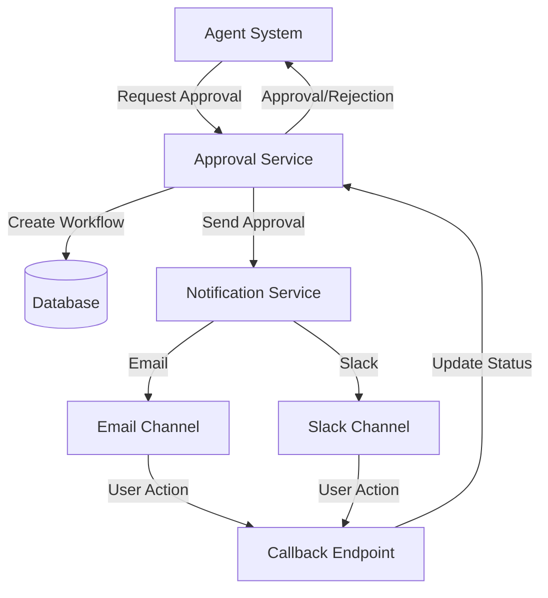

# Human-in-the-Loop Approval System

A robust, event-driven orchestration system designed to manage human-in-the-loop approvals in agent-based workflows.

## Problem Statement

Modern agent systems often require human approvals or feedback before executing critical actions such as purchases, deployments, or contract signings. This system provides a flexible, configurable solution for managing these approval workflows asynchronously across multiple channels.

## Key Features

- **Multi-channel Approval System**: Supports various communication channels (Email, Slack, etc.)
- **Event-Driven Architecture**: Asynchronous processing of approvals and responses
- **State Management**: Tracks approval status and workflow state
- **Dynamic UI**: Configurable approval interfaces
- **Retry & Timeout Handling**: Built-in mechanisms for handling delays and failures

## Architecture



### Components

- Approval Service: Core service managing approval workflows  
- Notification Service: Handles multi-channel notifications  
- Database: Stores workflow state and configurations  
- API Gateway: Entry point for all external communications  
- Frontend: Dynamic UI Template management(In-progress) 

## Getting Started

### Prerequisites

- Java 17+
- MySQL 8.0+
- Maven 3.8+
- AWS Account (for SQS)

### Environment Setup

```
AWS_ACCESS_KEY=
AWS_ACCOUNT_ID=
AWS_REGION=
AWS_SECRET_KEY=
AWS_SQS_REGION=
DB_PASSWORD=
EMAIL_ADDRESS_FROM=
MAILGUN_API_KEY=
MAILGUN_DOMAIN=
```

CLI Arguments -> `--spring.profiles.active=local`

## API Documentation

Access the Swagger UI at:  
`http://localhost:8080/swagger-ui.html`
